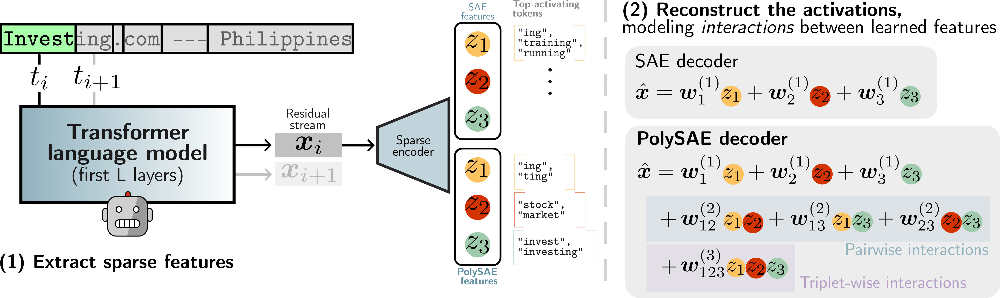

# PolySAE: Modeling Feature Interactions in Sparse Autoencoders via Polynomial Decoding

[](https://icml.cc/Conferences/2026)
[](https://arxiv.org/abs/2602.01322)
[](LICENSE)
[](https://pytorch.org/)

## TL;DR

PolySAE extends the SAE decoder with polynomial terms to model pairwise and triple feature interactions, capturing compositional structure that linear decoders cannot represent, while preserving the linear encoder essential for interpretability.

---

## Overview

<p align="center">
  
</p>

<p align="center"><strong>Accepted at ICML 2026</strong></p>

**Linear reconstruction cannot capture composition.** Standard SAEs reconstruct activations as linear combinations of dictionary atoms, an assumption that cannot distinguish whether "Starbucks" arises from the composition of "star" and "coffee" features or merely their co-occurrence. This forces SAEs to allocate monolithic features for compound concepts.

**A polynomial decoder.** PolySAE replaces the linear decoder with a low-rank polynomial expansion that captures pairwise and triple feature interactions on a shared low-rank projection subspace. The polynomial decoder adds only ~3% parameter overhead on GPT-2 small, preserves a linear encoder, and is composable on top of any existing activation scheme (TopK, BatchTopK, JumpReLU, Matryoshka).

**Compositional structure beyond co-occurrence.** Learned interaction weights exhibit negligible correlation with co-occurrence frequency (r = 0.06 vs. r = 0.82 for SAE feature covariance), indicating that polynomial terms capture compositional structure (morphological binding, phrasal composition) largely independent of surface statistics.

**Causal use of learned directions.** The learned interaction directions causally steer model outputs toward the corresponding compositional semantics: PolySAE outperforms vanilla SAE on 21/27 concepts and yields 19.7% higher cosine alignment with difference-in-means ground-truth directions.

---

## Results at a glance

|  |  |
|---|---|
| **Probing F1 (4 LLMs × 3 sparsifiers)** | **+8%** average over vanilla SAE, **+10%** on GPT-2 |
| **Wasserstein distance (class-conditional)** | **2–10×** larger than vanilla SAE |
| **Reconstruction (MSE / CE recovery)** | Comparable to vanilla SAE (CE within 0.003 across all 12 configs) |
| **Parameter overhead** | ~3% on GPT-2 small |
| **Co-occurrence correlation of learned interactions** | **r = 0.06** vs. r = 0.82 for SAE covariance |
| **Interpretable interactions (LLM-as-judge)** | **8,550** pairs scoring ≥ 0.9 out of 70K evaluated |
| **Compositional steering** | PolySAE wins **21/27** concepts vs. vanilla SAE, +41.5 mean rank improvement |
| **Direction alignment with ground truth** | **+19.7%** cosine similarity vs. vanilla SAE |

Full numbers in the paper (Tables 1–6).

---

## 🧩 Compositional interactions, decoded

When two PolySAE features co-activate, the polynomial decoder lifts their interaction into a new semantic dimension that neither feature occupies alone. Vanilla SAE collapses these compositions onto the closest single feature, losing the compositional structure entirely.

> #### `star` × `coffee` → **Starbucks**
> *"…an espresso shot poured over the top? **Starbucks**…"*
>
> **PolySAE** binds two everyday features into a specific brand entity.
> **Vanilla SAE** falls back to `[Apple, Google]`, recognizing only the brand category, not the composition.

> #### `secret` × `Snowden` → **WikiSecrets**
> *"…a Frontline documentary called **WikiSecrets**…"*
>
> **PolySAE** composes a coined term from its topical constituents.
> **Vanilla SAE** activates `[secret, secrets]`, recovering one component and missing the binding.

> #### `genetic` × `mod` → **genetic modification**
> *"…campaign against genetic **mod**ification…"*
>
> **PolySAE** binds the *action* (modification) to the *domain* (genetics).
> **Vanilla SAE** activates `[modified, edit]`, capturing modification in the abstract.

> #### `surgery` × `Trans` → **gender reassignment surgery**
> *"…a lengthy process to get gender reassignment **surgery**…"*
>
> **PolySAE** specializes a general concept by domain context.
> **Vanilla SAE** activates `[birth, baby]`, missing the specialization.

> #### `Canada` × `oil` → **Keystone Pipeline**
> *"…opposing the Trans-Canada Keystone **Pipeline**…"*
>
> **PolySAE** composes a named entity from geography × resource.
> **Vanilla SAE** activates `[oil, gas]`, recovering the resource but not the entity.

---

## 🎯 Steering with compositional directions

Adding the sum of two interacting decoder directions, $d_i + d_j$, to GPT-2's residual stream steers generation toward the compositional target. PolySAE achieves lower target-token rank than no steering in **71% of 324 evaluations** and outperforms vanilla SAE on **21 of 27 concepts** (+41.5 mean rank improvement).

> #### Steering with `canada` × `oil` → *Keystone*
> **Prompt** &nbsp; *"The controversial cross-border pipeline project is called the"*
>
> 🔘 **No steering** &nbsp; *Trans-Pacific Partnership*, a major step forward for the U.S. and Canada.
> 🔘 **Vanilla SAE** &nbsp; *Trans Mountain pipeline*, a controversial project in the works for years.
> ✅ **PolySAE** &nbsp; ***Keystone XL***. The pipeline would carry crude oil from Alberta to U.S. refineries.

> #### Steering with `surgery` × `trans` → *gender*
> **Prompt** &nbsp; *"The procedure that helps individuals align their body with their identity is"*
>
> 🔘 **No steering** &nbsp; called "*body alignment*". The procedure involves the body aligning…
> 🔘 **Vanilla SAE** &nbsp; called "*body alignment*". The procedure involves the use of a combination…
> ✅ **PolySAE** &nbsp; called "***gender identity surgery***". Performed by a surgeon who specializes in gender…

> #### Steering with `economic` × `times` → *Economist*
> **Prompt** &nbsp; *"The magazine with coverage of world politics and business is The"*
>
> 🔘 **No steering** &nbsp; *New York Times*. The magazine with coverage of world politics and business is The New York Times.
> 🔘 **Vanilla SAE** &nbsp; *New York Times*. The New York Times is a daily newspaper in the United States…
> ✅ **PolySAE** &nbsp; ***Economist***. The Economist is a magazine that is a global news magazine…

> #### Steering with `ers` × `admin` → *faculty*
> **Prompt** &nbsp; *"The university hired new"*
>
> 🔘 **No steering** &nbsp; *security guards* to guard the campus…
> 🔘 **Vanilla SAE** &nbsp; *security guards* to guard the campus…
> ✅ **PolySAE** &nbsp; ***faculty members*** to help improve its academic performance…

> #### Steering with `ized` × `treatment` → *vaccination*
> **Prompt** &nbsp; *"Parents were urged to bring their children in for scheduled"*
>
> 🔘 **No steering** &nbsp; visits to the hospital after a man was *shot and killed* in a shooting…
> 🔘 **Vanilla SAE** &nbsp; visits to the hospital after a man was *shot and killed* in a shooting…
> ✅ **PolySAE** &nbsp; ***vaccinations***, but the government has not yet taken action…

See `Section 5.2` of the paper for the full protocol.

---

## Installation

> **The repo bundles modified copies of SAELens and SAEBench.** The PyPI distributions of `sae_lens` / `sae_bench` are **not** compatible: they lack the PolySAE decoder and the metric hooks this codebase relies on. Use the bundled forks, not PyPI.

The SAELens fork lives at the repository root (it *is* the package this repo installs); the SAEBench fork lives at [`./SAEBench`](./SAEBench).

```bash
git clone https://github.com/pakoromilas/PolySAE.git
cd PolySAE

python -m venv .venv
source .venv/bin/activate
pip install --upgrade pip

# Install the bundled SAELens fork (the root of this repo)
pip install -e .

# Install the bundled SAEBench fork
pip install -e ./SAEBench
```

After installation, `python -c "import sae_lens, sae_bench"` should resolve to modules **inside this repo**, not under `site-packages`. The smoke test in `tests/test_polysae_imports.py` checks exactly that.

Python 3.9+ and a CUDA-capable GPU. Optional environment variables: `POLYSAE_CACHE_DIR` (default `./cache`), `POLYSAE_OUTPUT_DIR` (default `./outputs`), `HF_TOKEN` (required for gated models like Gemma), and `WANDB_PROJECT` / `WANDB_ENTITY` (off by default; pass `--wandb` to enable).

---

## Quick start

A minimal smoke run on GPT-2 Small layer 8 with a tiny token budget:

```bash
python train_and_saebench.py \
  --exp gpt2_l8 --architecture topk --width 16k --k 64 \
  --training_tokens 1000000 --context_size 128 \
  --no_rescale_by_decoder_norm --use_saelens_defaults \
  --poly --shared_u --poly_order 3 --poly_ranks 768,64,64
```

This trains a PolySAE for ~1M tokens and saves the checkpoint to `checkpoints/<auto-named>/`. Add `--run_saebench` to follow training with the SAEBench evaluation suite.

---

## ⚠️ A note on SAEBench evaluations

Many SAEBench metrics (SCR, TPP, Feature Absorption, RAVEL) assume a **linear encoder–decoder geometry**: they measure properties of the decoder's column space, ablate single dictionary atoms, or rely on linear attributions through the decoder. PolySAE's decoder is polynomial, so these assumptions do not hold, and we have not yet figured out the proper generalization of these metrics to non-additive decoders.

For completeness, the bundled SAEBench fork **still runs SCR, TPP, Feature Absorption, and RAVEL on PolySAE**, but the resulting numbers are computed under the linear-decoder assumption and are therefore **misleading**. Treat these scores as not-yet-meaningful for PolySAE, and rely instead on the metrics validated in the paper:

- **L0 / Loss Recovered / Reconstruction MSE** — well-defined for any decoder.
- **Sparse Probing F1** — the main evaluation in the paper (Table 1).

A principled generalization of the linear-encoder metrics to polynomial decoders is an open direction for future work.

---

## Reproducing the paper

The following commands reproduce the **TopK and PolySAE** rows of Table 1. The BatchTopK and Matryoshka rows follow the **same pattern**: substitute `--architecture batchtopk` or `--architecture matryoshka`. All other hyperparameters stay identical.

```bash
# GPT-2 Small (layer 8) — TopK baseline
python train_and_saebench.py --exp gpt2_l8 --architecture topk --width 16k --k 64 \
  --training_tokens 300000000 --context_size 128 --no_rescale_by_decoder_norm \
  --run_saebench --use_saelens_defaults

# GPT-2 Small — PolySAE
python train_and_saebench.py --exp gpt2_l8 --architecture topk --width 16k --k 64 \
  --training_tokens 300000000 --context_size 128 --no_rescale_by_decoder_norm \
  --run_saebench --use_saelens_defaults \
  --wandb_run_name poly_o3_r768_64_64_topk_gpt2 \
  --poly --shared_u --poly_order 3 --poly_ranks 768,64,64

# Pythia-410M (layer 15) — TopK baseline
python train_and_saebench.py --exp pythia410m_l15 --architecture topk --width 16k --k 64 \
  --training_tokens 500000000 --context_size 128 --no_rescale_by_decoder_norm \
  --run_saebench --use_saelens_defaults --wandb_run_name topk_pythia

# Pythia-410M — PolySAE
python train_and_saebench.py --exp pythia410m_l15 --architecture topk --width 16k --k 64 \
  --training_tokens 500000000 --context_size 128 --no_rescale_by_decoder_norm \
  --run_saebench --use_saelens_defaults \
  --wandb_run_name poly_o3_r1024_128_128_topk_pythia \
  --poly --shared_u --poly_order 3 --poly_ranks 1024,128,128

# Pythia-1.4B (layer 12) — TopK baseline
python train_and_saebench.py --exp pythia1_4b_l12 --architecture topk --width 16k --k 64 \
  --training_tokens 500000000 --context_size 128 --no_rescale_by_decoder_norm \
  --wandb_run_name topk_pythia14b --run_saebench --use_saelens_defaults

# Pythia-1.4B — PolySAE
python train_and_saebench.py --exp pythia1_4b_l12 --architecture topk --width 16k --k 64 \
  --training_tokens 500000000 --context_size 128 --no_rescale_by_decoder_norm \
  --wandb_run_name poly_o3_r2048_128_128_topk_pythia14b \
  --run_saebench --use_saelens_defaults \
  --poly --shared_u --poly_order 3 --poly_ranks 2048,128,128

# Gemma-2-2B (layer 12) — TopK baseline
python train_and_saebench.py --exp gemma2_2b_l12 --architecture topk --width 16k --k 64 \
  --training_tokens 500000000 --context_size 128 --no_rescale_by_decoder_norm \
  --n_batches_in_buffer 32 --train_batch_size_tokens 4096 \
  --wandb_run_name topk_gemma2 --run_saebench --use_saelens_defaults

# Gemma-2-2B — PolySAE
python train_and_saebench.py --exp gemma2_2b_l12 --architecture topk --width 16k --k 64 \
  --training_tokens 500000000 --context_size 128 --no_rescale_by_decoder_norm \
  --n_batches_in_buffer 32 --train_batch_size_tokens 4096 \
  --wandb_run_name poly_o3_r2304_128_128_topk_gemma2 \
  --run_saebench --use_saelens_defaults \
  --poly --shared_u --poly_order 3 --poly_ranks 2304,128,128
```

Each `train_and_saebench.py` invocation trains the SAE and then runs the SAEBench evaluation suite (see the caveat above on which metrics are meaningful for PolySAE), writing JSON results under the working directory. Pass `--wandb` to stream metrics to Weights & Biases.

---

## Repo map

- `sae_lens/saes/polysae.py`: the PolySAE decoder, low-rank polynomial expansion, orthogonality constraints.
- `train_and_saebench.py`: training entry point with optional SAEBench evaluation.
- `train_sae.py` / `eval_sae.py`: standalone training and evaluation scripts.
- `SAEBench/`: bundled SAEBench fork with PolySAE-compatible metric hooks.
- `tests/`: smoke tests for imports, CLI parsing, and PolySAE forward passes.

---

## Tests

```bash
pytest tests/test_polysae_imports.py tests/test_polysae_cli.py tests/saes/test_polysae_smoke.py
```

These run quickly on CPU. They verify that:

- The bundled `sae_lens` / `sae_bench` resolve inside the repo (not PyPI).
- Every CLI flag referenced by the paper commands above is parsed correctly.
- A PolySAE for each `(architecture, rank-tuple)` config instantiates with the expected parameter-count overhead and runs one finite forward pass.

A heavier 100-step training-loss-decreases check is gated behind `RUN_HEAVY=1`.

---

## Citation

```bibtex
@misc{koromilas2026polysaemodelingfeatureinteractions,
      title={PolySAE: Modeling Feature Interactions in Sparse Autoencoders via Polynomial Decoding}, 
      author={Panagiotis Koromilas and Andreas D. Demou and James Oldfield and Yannis Panagakis and Mihalis Nicolaou},
      year={2026},
      eprint={2602.01322},
      archivePrefix={arXiv},
      primaryClass={cs.LG},
      url={https://arxiv.org/abs/2602.01322}, 
}
```

---

## Acknowledgments

This repository is a derivative work built on two open-source projects, both bundled here as modified forks:

- **SAELens** by Joseph Bloom, Curt Tigges, Anthony Duong, and David Chanin — <https://github.com/jbloomAus/SAELens>. The repository root is a fork of SAELens. The PolySAE additions live at `sae_lens/saes/polysae.py` plus the top-level `train_and_saebench.py` / `train_sae.py` / `eval_sae.py` entry points; everything else under `sae_lens/`, `tests/`, `tutorials/`, `docs/`, and `benchmark/` is the upstream codebase. The upstream MIT license applies.
- **SAEBench** by Adam Karvonen, Can Rager, and collaborators — <https://github.com/adamkarvonen/SAEBench>. Bundled at [`./SAEBench`](./SAEBench) with light modifications for PolySAE compatibility. See SAEBench's own `LICENSE` and `CHANGELOG.md` for upstream attribution.

We are grateful to both communities for the foundational tooling.

## License

MIT. See [`LICENSE`](./LICENSE). The bundled forks retain their own MIT licenses where applicable.
